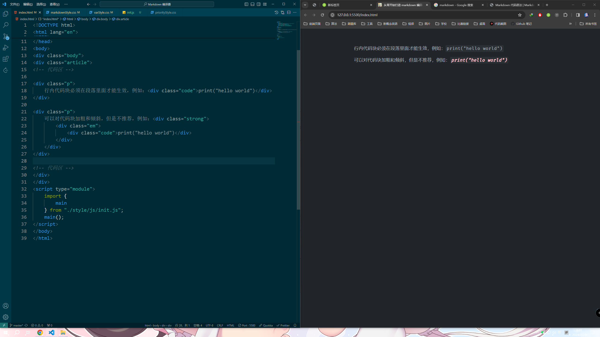

# 代码块

## 行内代码块

```html
<div class="code">
    print("hello world")
</div>
```

示例：

```html
<div class="p">
    行内代码块必须在段落里面才能生效，例如：<div class="code">print("hello world")</div>
</div>

<div class="p">
    可以对代码块加粗和倾斜，但是不推荐，例如：<div class="strong">
        <div class="em">
            <div class="code">print("hello world")</div>
        </div>
    </div>
</div>
```

效果：

