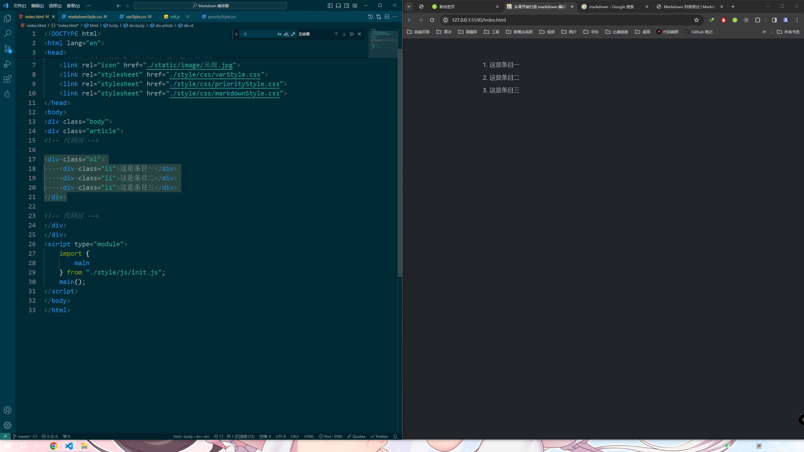
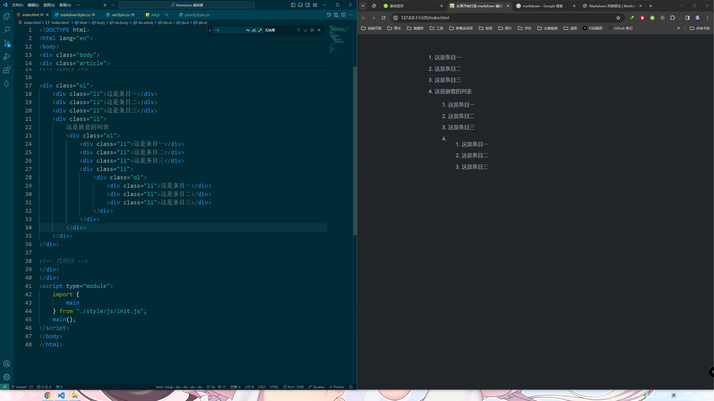
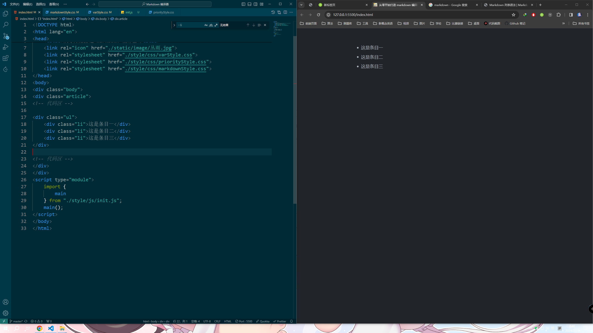
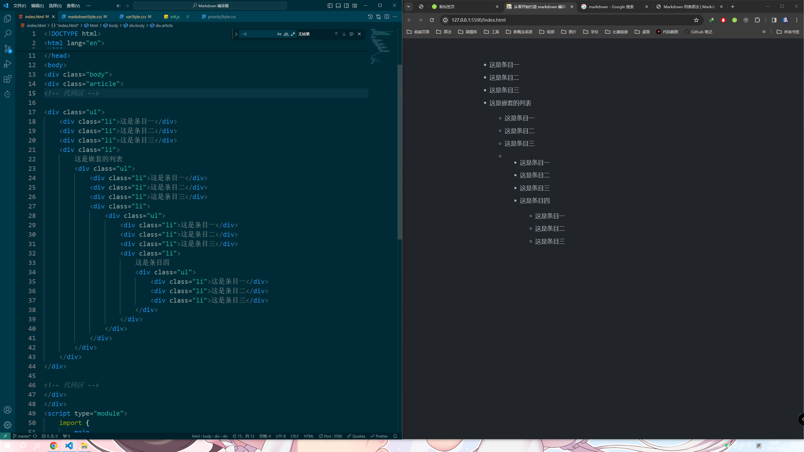

# 列表

## 有序列表

```html
<div class="ol">
    <div class="li"><div class="p">这是条目一</div></div>
    <div class="li"><div class="p">这是条目二</div></div>
    <div class="li"><div class="p">这是条目三</div></div>
</div>
```

效果：



支持嵌套：

  


## 无序列表

```html
<div class="ul">
    <div class="li"><div class="p">这是条目一</div></div>
    <div class="li"><div class="p">这是条目二</div></div>
    <div class="li"><div class="p">这是条目三</div></div>
</div>
```

效果：



支持嵌套：

