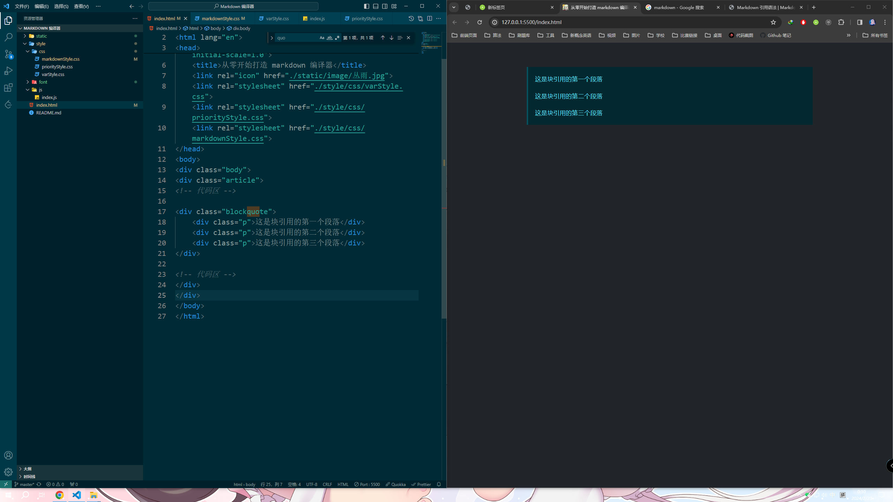
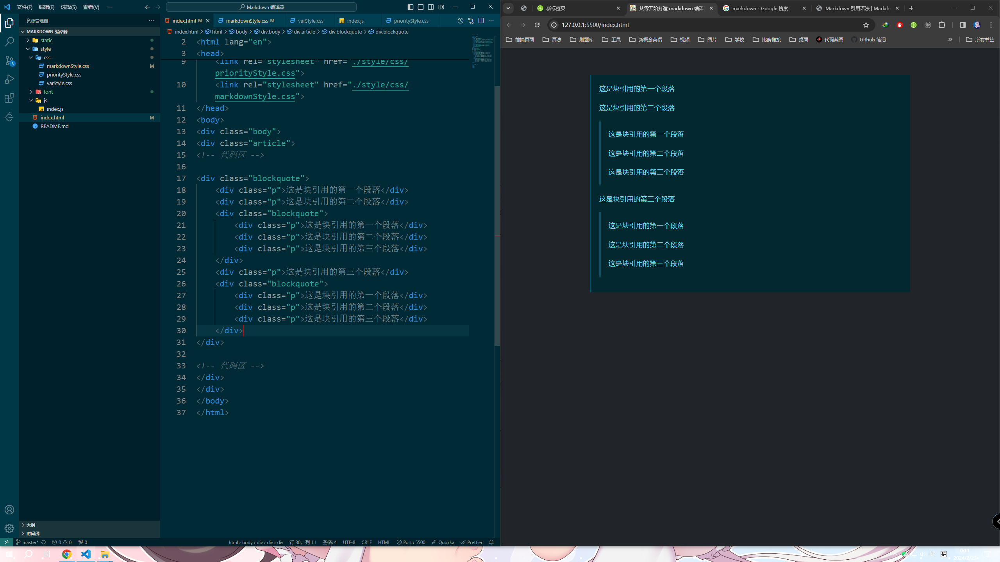

# 块引用

```html
<div class="blockquote">
    <div class="p">这是块引用的第一个段落</div>
    <div class="p">这是块引用的第二个段落</div>
    <div class="p">这是块引用的第三个段落</div>
</div>
```

效果：

  


支持嵌套块引用：

```html
<div class="blockquote">
    <div class="p">这是块引用的第一个段落</div>
    <div class="p">这是块引用的第二个段落</div>
    <div class="blockquote">
        <div class="p">这是块引用的第一个段落</div>
        <div class="p">这是块引用的第二个段落</div>
        <div class="p">这是块引用的第三个段落</div>
    </div>
    <div class="p">这是块引用的第三个段落</div>
    <div class="blockquote">
        <div class="p">这是块引用的第一个段落</div>
        <div class="p">这是块引用的第二个段落</div>
        <div class="p">这是块引用的第三个段落</div>
    </div>
</div>
```

  
