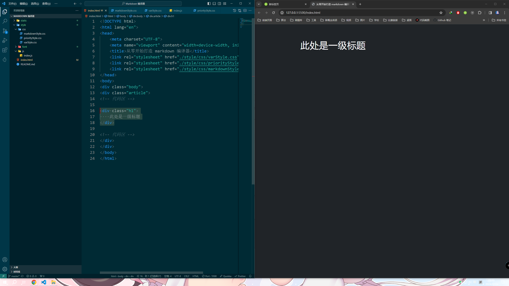
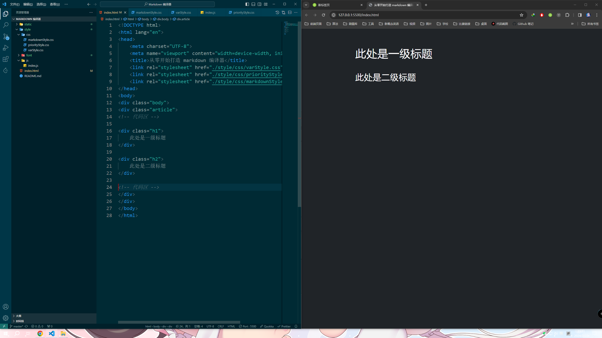
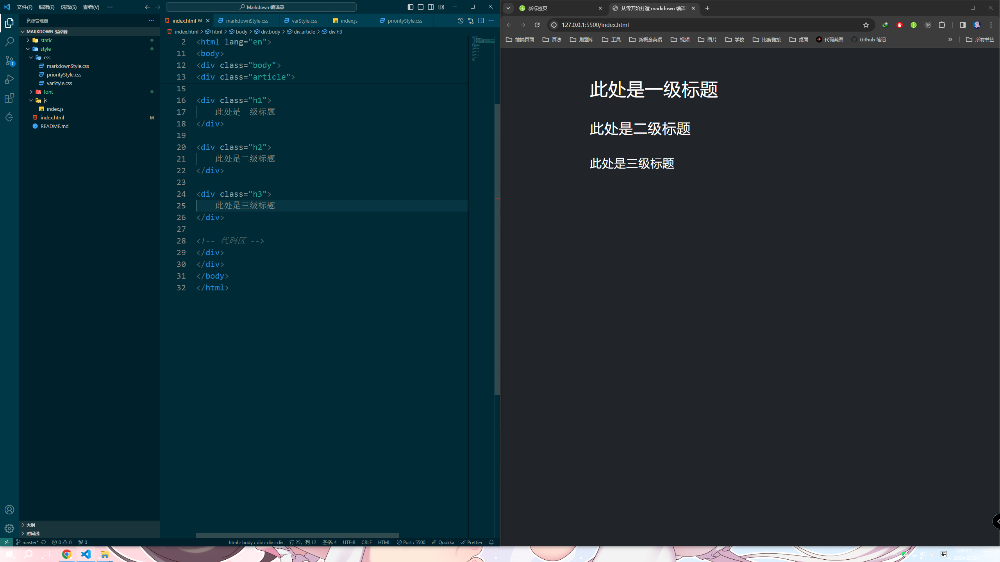
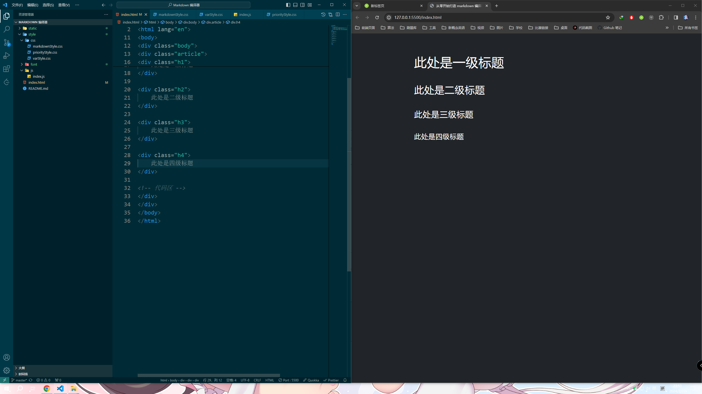
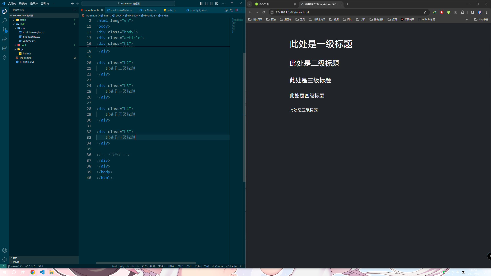

# 标题

## 一级标题

```html
<div class="h1">
    此处是一级标题
</div>
```

效果：

  

## 二级标题

```html
<div class="h2">
    此处是二级标题
</div>
```

效果：

  

## 三级标题

```html
<div class="h3">
    此处是三级标题
</div>
```

效果：

  

## 四级标题

```html
<div class="h4">
    此处是四级标题
</div>
```

效果：

  


## 五级标题

```html
<div class="h5">
    此处是五级标题
</div>
```

效果：

  

## 六级标题

```html
<div class="h6">
    此处是六级标题
</div>
```

效果：

