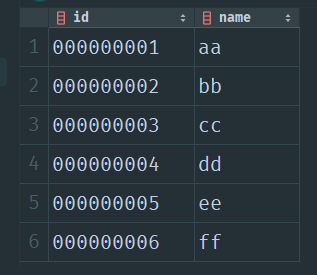
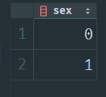
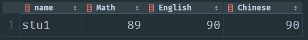
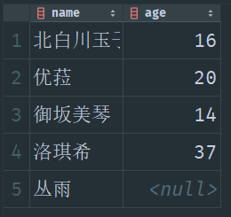

# 4. select

## 查询表的全部内容

```sql
select * from humans;
```

  

## 查询多列内容

```sql
select id, name from humans;
```

  

## distinct：对查询的内容去重

比如查询 sex 列时，会返回 6 行数据，但是去除重复之后，其实只有两条有效信息:

```sql
select sex from humans;
```

  

distinct 去除重复行：

```sql
select distinct sex from humans;
```

  

注意，distinct 是先查询所有的行，然后丢弃掉已经存在的相同的行：

```sql
select a_col, b_col from Test;
```


```sql
select distinct a_col, b_col from Test;
```

  

## limit 获取前 n 行数据

假设我需要获取 humans 表的前 3 行数据：

```sql
select * from humans limit 3;
```

  

从第 2 行开始的前 3 行数据

**注意，行号是从 0 开始编号的！**

```sql
select * from humans limit 2, 3;
```

  

行号是这样列的：

第 0 行，第 1 行，第 2 行，第 3 行，第 4 行，第 5 行 ··· ···

## 使用列的全称查询

```sql
select id, name from humans;
```

使用列的全称后：

```sql
select humans.id, humans.name from humans;
```

  

## 给列取别名

```sql
select humans.id 编号, humans.name 名称 from humans
```

或者:

```sql
select humans.id as 编号, humans.name as 名称 from humans
```

  

## order by: 对查询到的列排序

假设有如下表内容：

  

### 根据单列的内容排序

按照 id 排序查询数学、英语、语文成绩内容：

```sql
select id, Math, English, Chinese from Student
order by id;
```

  

### 根据多列的内容排序

按照英语成绩排序，如果成绩相同，就按照学号排序：

```sql
select id, name, English from Student
order by English, id;
```

  

### 对某列降序要求

按照英语成绩从高到低排序，如果成绩相同，就按照学号递增顺序排序：

```sql
select id, name, English from Student
order by English desc, id;
```

  

## where: 过滤数据

### where 比较运算符

```sql
=                   等于
<>                  不等于
!=                  不等于
<                   小于
<=                  小于等于
>                   大于
>=                  大于等于
between a and b     介于 [a, b] 之间
```

---

查找数学成绩在 90 到 100 的学生姓名：

```sql
select name from Student
where Math between 90 and 100;
```

  

---

查找数学成绩大于 80 分的学生姓名：

```sql
select name, Math from Student
where Math > 80;
```

  

---

查询数学成绩最高的学生的整体成绩：

```sql
select name, Math, English, Chinese from Student
where Math = (select max(Math) from Student );
```

  

---

查找除数学成绩最高之外的其他学生成绩：

```sql
select name, Math, English, Chinese from Student
where Math <> ( select max(Math) from Student);
```

  

---


### null 值检查

假设有如下表：

  


获取年龄为 null 的角色：

```sql
select name from Wifes
where age is null;
```

  

### where 逻辑运算符

```sql
and                 逻辑与
or                  逻辑或
not                 逻辑非
in                  存在于
```

---

查询数学、英语、语文成绩同时大于或等于 80 的学生

```sql
select name, Math, English, Chinese from Student
where Math >= 80 and English >= 80 and Chinese >= 80;
```

  

---

查询『丛雨』或者『优菈』的年龄：

```sql
select name, age from Wifes
where name in ('丛雨', '优菈');
```

  


---

### where 子句中不能列别名

查询数学、英语、语文成绩同时大于或等于 80 的学生

<details error><summary>错误代码</summary>

```sql
select name, Math m, English e, Chinese c from Student
where m >= 80 and e >= 80 and c >= 80;
```

</details>

<details accept><summary>正确代码</summary>

```sql
select name, m Math, e English, c Chinese
from ( select name, Math m, English e, Chinese c from Student ) temp_table
where m >= 80 and e >= 80 and c >= 80;
```

  


</details>

## regexp: 正则表达式

查询 humans 表中 id 以 1 - 5 结尾的行：

```sql
select * from humans
where id REGEXP '.*?[1-5]';
```

  

## concat: 对查询到的列拼接其他字符串

假设有如下表：

  

将姓与名结合：

```sql
select concat('姓名：', surname, name) as 姓名 from people;
```

  

## group by: 分组

对于每一组的处理结果，应该只返回一条数据

---

计算 humans 表中男生和女生的数量：

```sql
select sex, count(sex)
from humans
group by sex;
```

  

解释：

先按照 sex 的取值分组，分成 sex = 0、sex = 1 两组，对每一组统计个数

### having: 过滤分组

统计 humans 表中的男生数量：

```sql
select sex, count(sex)
from humans
group by sex
having sex = 0;
```

  

当然，应该先过滤掉女生然后再分组效率会更高：

```sql
select sex, count(sex)
from humans
where sex <> 1
group by sex;
```

**注意：如果使用了聚合函数，则与聚合函数靠在一起的列也必须是单条结果，例如 select sex, count(sex)，这里 sex 必须是单条结果**

<details error><summary>错误代码</summary>

这条语句会返回多个结果的 sex，但是只有一个结果的 count，两者合并不了，报错！

```sql
select sex, count(sex)
from humans
where sex <> 1;
```

</details>

## 子查询

### 在 where 子句中使用子查询

假设有如下两张表：

wifes 表：

  

roles 表：

  

---

我想要查询 wifes 表中所有角色的信息：

方法一：子查询

```sql
select * from roles
where name in ( select name from wifes );
```

  

方法二：联结表

```sql
select roles.name, roles.sex, roles.word, roles.attribute, roles.appearance from roles, wifes
where roles.name = Wifes.name;
```

  


---

### 在列选项中使用子查询

假设有一张购物表 buys，表示用户购买的东西：

  

统计每位顾客购买的数量：

方法一：子查询

```sql
select distinct name 名字, ( select count(*) from buys where name = 名字 ) 购物数量
from buys;
```

  


方法二：分组查询

```sql
select name, count(*) from buys
group by name;
```

  


---

## 内联结

内联结，意思就是<u>先笛卡尔积后</u>，通过<u>一定的条件筛选</u>出需要的信息

---

wifes 表：

  

roles 表：

  

查找 wifes 表中的角色信息：

```sql
select roles.*
from wifes inner join roles 
on wifes.name = roles.name;
```

这句话的功能与下面的等同

```sql
select roles.*
from wifes, roles
where Wifes.name = roles.name;
```

  

---

## 相关表数据

<details accept><summary>插入数据</summary>

```sql
create table humans (
    id varchar(32),
    name varchar(20),
    sex int
);

insert into humans value
    ('000000001', 'aa', 0),
    ('000000002', 'bb', 1),
    ('000000003', 'cc', 0),
    ('000000004', 'dd', 0),
    ('000000005', 'ee', 1),
    ('000000006', 'ff', 0);
```

```sql
create table Test (
                        a_col varchar(20),
                        b_col varchar(20)
);

insert into Test value
    ('a6', 'b6'),
    ('a2', 'b2'),
    ('a1', 'b1'),
    ('a6', 'b6'),
    ('a2', 'b2'),
    ('a1', 'b1');
```

```sql
create table Student (
    id varchar(20),
    name varchar(20),
    Math int,
    English int,
    Chinese int
);

insert into Student values
                        ('6', 'stu6', 76, 46, 79),
                        ('1', 'stu1', 89, 90, 90),
                        ('7', 'stu7', 43, 48, 84),
                        ('3', 'stu3', 56, 78, 86),
                        ('8', 'stu8', 91, 78, 86),
                        ('5', 'stu5', 87, 60, 81),
                        ('4', 'stu4', 68, 15, 73),
                        ('2', 'stu2', 99, 56, 90);
```

```sql
create table Wifes (
    name varchar(20),
    age int
);

insert into Wifes values
                      ('北白川玉子', 16),
                      ('优菈', 20),
                      ('御坂美琴', 14),
                      ('洛琪希', 37);

insert into Wifes (name) value ('丛雨');
```

```sql
create table people (
                        surname varchar(20),
                        name varchar(20)
);

insert into people values
                       ('涂山', '雅雅'),
                       ('涂山', '容容'),
                       ('涂山', '苏苏'),
                       ('东方', '月初'),
                       ('白', '月初');
```

```sql
create table roles (
    name varchar(200),
    sex varchar(200),
    word varchar(200),
    attribute varchar(200),
    appearance varchar(200)
);

# drop table roles;

insert into roles values
    ('丛雨', '女', '千恋万花', '傲娇,萝莉', '绿发,红瞳'),
    ('蕾娜·列支敦瑙尔', '女', '千恋万花', '元气,天然', '金发,紫瞳,双马尾,巨乳'),
    ('朝武芳乃', '女', '千恋万花', '巫女', '蓝瞳,白发,双马尾'),
    ('常陆茉子', '女', '千恋万花', '忍者,腹黑', '黑发,绿瞳'),
    ('北白川玉子', '女', '玉子市场', '活泼开朗,冒失,呆萌', '黑发,青瞳'),
    ('优菈', '女', '原神', '高傲冷淡的外表下藏着脆弱而又坚强的心', '蓝短发,黑色蕾丝边发带,黑色连体紧身衣,黑色手套,高跟长筒靴'),
    ('御坂美琴', '女', '魔法禁书目录、科学超电磁炮', '高度的自尊,个性好胜且不服输,绝对的自信,独断独行', '胸围相当凄惨'),
    ('名波七爱', '女', '近月少女的礼仪', '女仆', '粉红色眼睛,黄色皮肤,蛋卷头,粉发');

```

```sql
create table buys (
    name varchar(20),
    item varchar(20)
);

insert into buys values
    ('小林', '红糖果'),
    ('小玲', '苹果'),
    ('小黄', '薯条'),
    ('檀溪', '麦片'),
    ('小林', '香蕉'),
    ('小玲', '牛排'),
    ('檀溪', '发夹'),
    ('小林', '耳机');
```

</details>