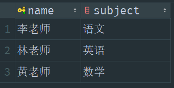

# 5. 外键

## 什么是外键？

某个表的取值范围，属于另外一个表的主键内容

## 举例

有一张 tch_info 表，记录老师的信息：

  

有一张学生表 stu_subject，记录学生修读课程与指导老师信息：

  

学生的指导老师，一定都在记录老师的信息的表 tch_info 里面，所以可以定义一个外键，建立这两张表的联系

<details note open><summary>建表代码</summary>

```sql
create table tch_info (
        name varchar(20),
        subject varchar(200),
        primary key (name)
);

create table stu_subject (
        name varchar(20),
        subject varchar(200),
        teacher varchar(20),
        primary key (name),
        foreign key (teacher) references tch_info (name)
);
```

</details>

## 相关数据

<details accept><summary>相关表代码</summary>

```sql
create table tch_info (
                          name varchar(20),
                          subject varchar(200),
                          primary key (name)
);

create table stu_subject (
                             name varchar(20),
                             subject varchar(200),
                             teacher varchar(20),
                             primary key (name),
                             foreign key (teacher) references tch_info (name)
);

insert into tch_info values
                         ('黄老师', '数学'),
                         ('林老师', '英语'),
                         ('李老师', '语文');

insert into stu_subject values
                            ('曾同学', '英语', '林老师'),
                            ('陈同学', '语文', '李老师');

select * from tch_info;
select * from stu_subject;
```

</details>