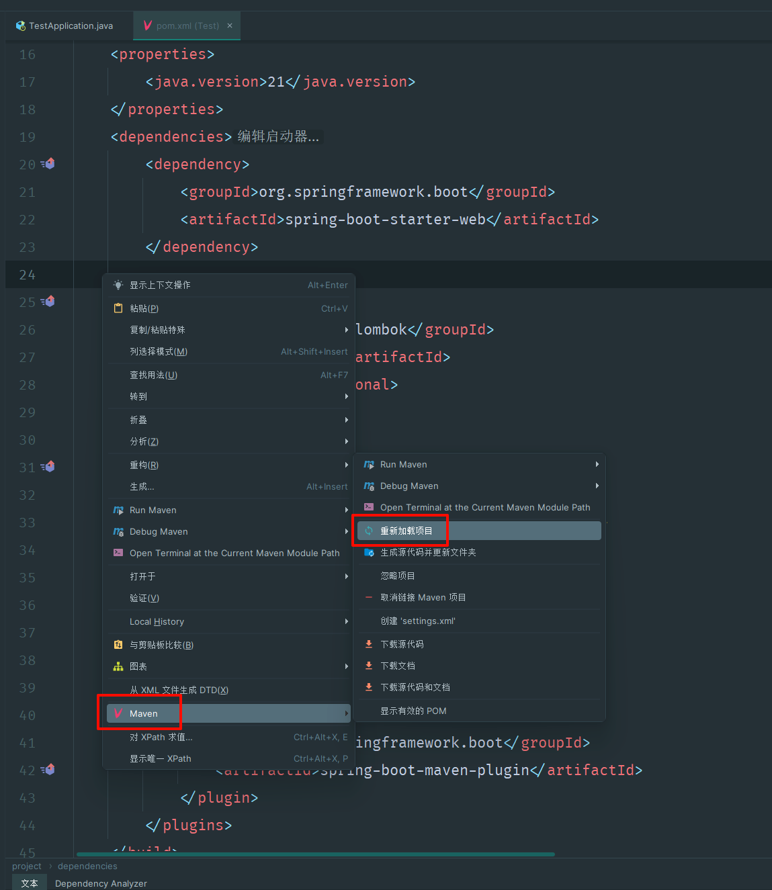

# 1. @data 注解

注解在类上, 为类提供读写属性, 此外还提供了 equals()、hashCode()、toString() 方法

示例：

<details open><summary>digit.class</summary>

```java
import lombok.Data;
@Data
class digit {
    public int value;
    public Integer key;
}
```

</details>

相当于下面代码：

<details open><summary>digit.class</summary>

```java
class digit {
    public int value;
    public Integer key;

    public digit() {
    }

    public int getValue() {
        return this.value;
    }

    public Integer getKey() {
        return this.key;
    }

    public void setValue(final int value) {
        this.value = value;
    }

    public void setKey(final Integer key) {
        this.key = key;
    }

    public boolean equals(final Object o) {
        if (o == this) {
            return true;
        } else if (!(o instanceof digit)) {
            return false;
        } else {
            digit other = (digit)o;
            if (!other.canEqual(this)) {
                return false;
            } else if (this.getValue() != other.getValue()) {
                return false;
            } else {
                Object this$key = this.getKey();
                Object other$key = other.getKey();
                if (this$key == null) {
                    if (other$key != null) {
                        return false;
                    }
                } else if (!this$key.equals(other$key)) {
                    return false;
                }

                return true;
            }
        }
    }

    protected boolean canEqual(final Object other) {
        return other instanceof digit;
    }

    public int hashCode() {
        int PRIME = true;
        int result = 1;
        result = result * 59 + this.getValue();
        Object $key = this.getKey();
        result = result * 59 + ($key == null ? 43 : $key.hashCode());
        return result;
    }

    public String toString() {
        int var10000 = this.getValue();
        return "digit(value=" + var10000 + ", key=" + this.getKey() + ")";
    }
}
```

</details>

---

类似的注解还有：

```java
@Getter     提供读函数

@Setter     提供写函数

@ToString   提供 toString 函数
```

## springboot 使用 lombok 依赖

在文件 `pom.xml` 中加入：

```xml
<dependency>
    <groupId>org.projectlombok</groupId>
    <artifactId>lombok</artifactId>
    <optional>true</optional>
</dependency>
```

更新 `maven` 依赖：

  
