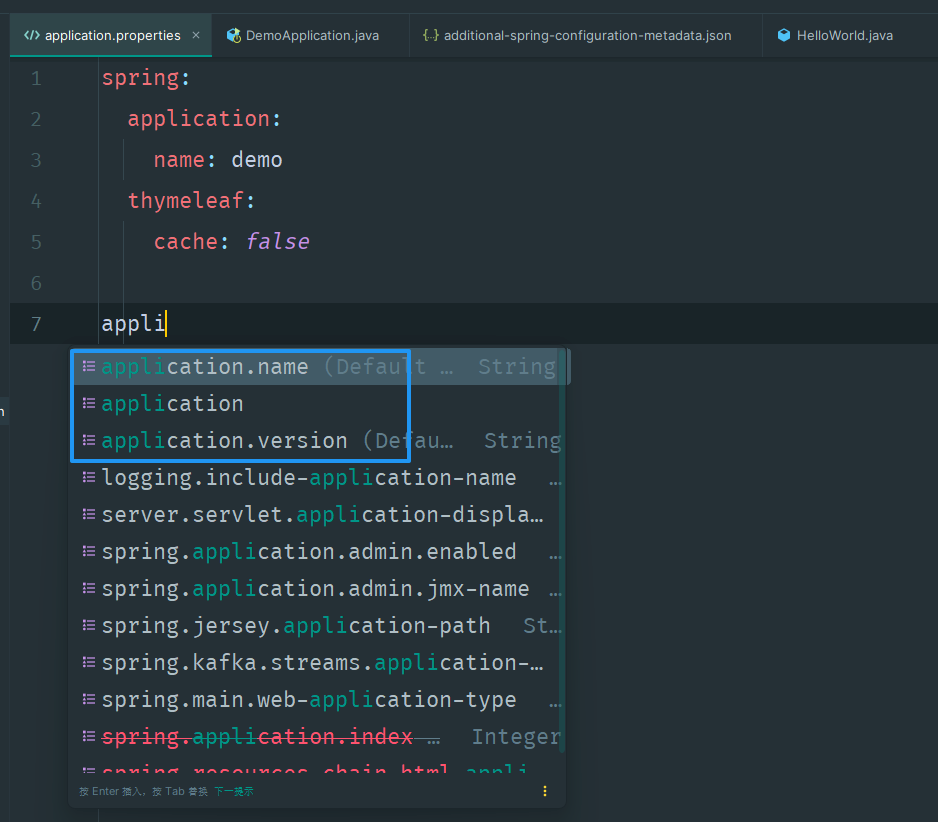
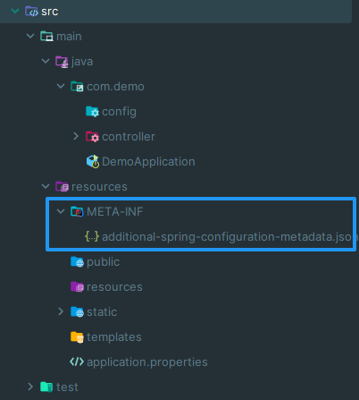

# 14. 自定义 application.yaml 提示选项

在 `resources` 目录下创建：`META-INF/additional-spring-configuration-metadata.json`

假如有如下内容：

<details><summary>META-INF/additional-spring-configuration-metadata.json</summary>

```json
{
  "properties": [
    {
      "name": "application.name",
      "description": "Default value is artifactId in pom.xml.",
      "type": "java.lang.String"
    },
    {
      "name": "application.version",
      "description": "Default value is version in pom.xml.",
      "type": "java.lang.String"
    },
    {
      "name": "developer.name",
      "description": "The Developer Name.",
      "type": "java.lang.String"
    },
    {
      "name": "developer.website",
      "description": "The Developer Website.",
      "type": "java.lang.String"
    },
    {
      "name": "developer.qq",
      "description": "The Developer QQ Number.",
      "type": "java.lang.String"
    },
    {
      "name": "developer.phone-number",
      "description": "The Developer Phone Number.",
      "type": "java.lang.String"
    }
  ]
}
```

</details>

在编写 application.yaml 文件时，输入 `application` 就会弹出提示选项：

  

---

路径示意图：

  
