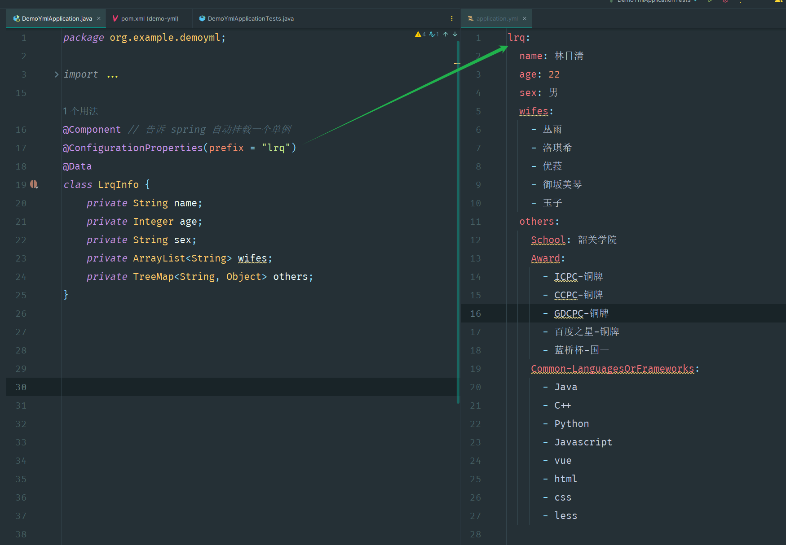
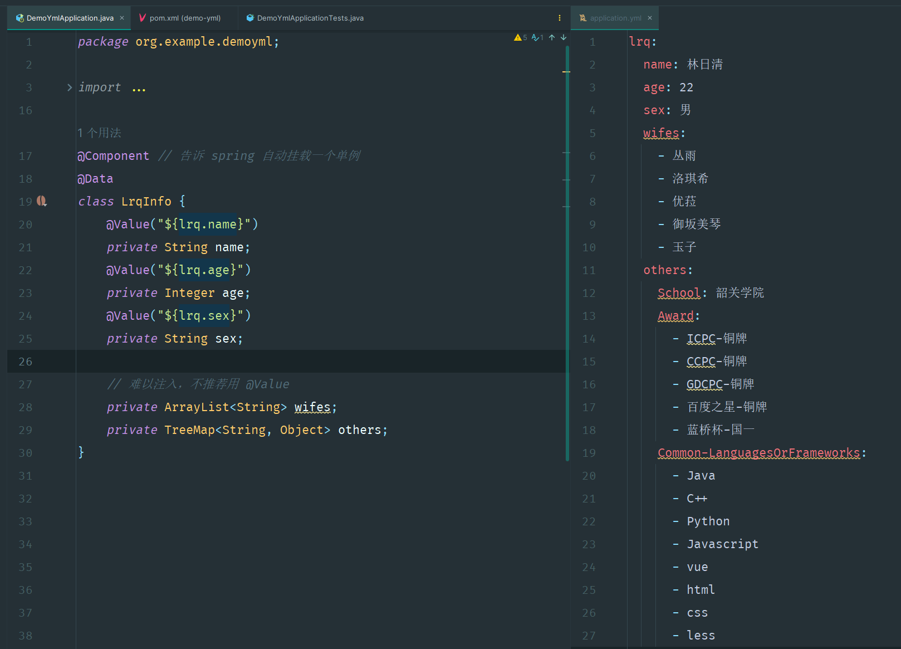

# 16. Java 类使用配置文件yml的信息

如果把配置信息写死在 Java 类的成员实例里面，将来若需要改变这些信息时，就得重新编译并运行 Java 程序

重新编译，重新运行

编译是非常耗时的一个操作！

---

如果把配置信息写在配置文件 application.yml 中，将来若需要改变这些信息时，只需要重新运行 Java 程序即可

不用重新编译，只需重新运行

## @ConfigurationProperties

自动装箱

  

<details><summary>Java 类代码</summary>

```java
@Component // 告诉 spring 自动挂载一个单例
@ConfigurationProperties(prefix = "lrq")
@Data
class LrqInfo {
    private String name;
    private Integer age;
    private String sex;
    private ArrayList<String> wifes;
    private TreeMap<String, Object> others;
}
```

</details>

<details><summary>配置文件代码</summary>

```yml
lrq:
  name: 林日清
  age: 22
  sex: 男
  wifes:
    - 丛雨
    - 洛琪希
    - 优菈
    - 御坂美琴
    - 玉子
  others:
    School: 韶关学院
    Award:
      - ICPC-铜牌
      - CCPC-铜牌
      - GDCPC-铜牌
      - 百度之星-铜牌
      - 蓝桥杯-国一
    Common-LanguagesOrFrameworks:
      - Java
      - C++
      - Python
      - Javascript
      - vue
      - html
      - css
      - less
```

</details>

## @Value

选择性装箱

当我们注入数组、对象时就会显得异常困难！

  

<details><summary>Java 类代码</summary>

```java
@Component // 告诉 spring 自动挂载一个单例
@Data
class LrqInfo {
    @Value("${lrq.name}")
    private String name;
    @Value("${lrq.age}")
    private Integer age;
    @Value("${lrq.sex}")
    private String sex;

    // 难以注入，不推荐用 @Value
    private ArrayList<String> wifes;
    private TreeMap<String, Object> others;
}

```

</details>

<details><summary>配置文件代码</summary>

```yml
lrq:
  name: 林日清
  age: 22
  sex: 男
  wifes:
    - 丛雨
    - 洛琪希
    - 优菈
    - 御坂美琴
    - 玉子
  others:
    School: 韶关学院
    Award:
      - ICPC-铜牌
      - CCPC-铜牌
      - GDCPC-铜牌
      - 百度之星-铜牌
      - 蓝桥杯-国一
    Common-LanguagesOrFrameworks:
      - Java
      - C++
      - Python
      - Javascript
      - vue
      - html
      - css
      - less
```

</details>