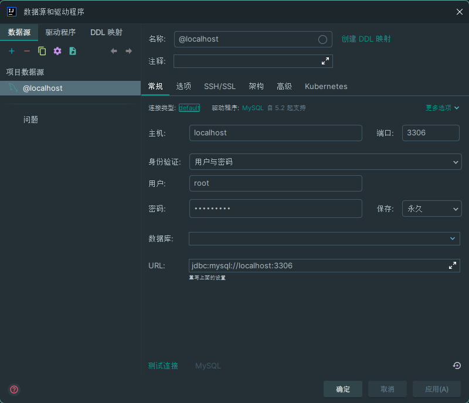
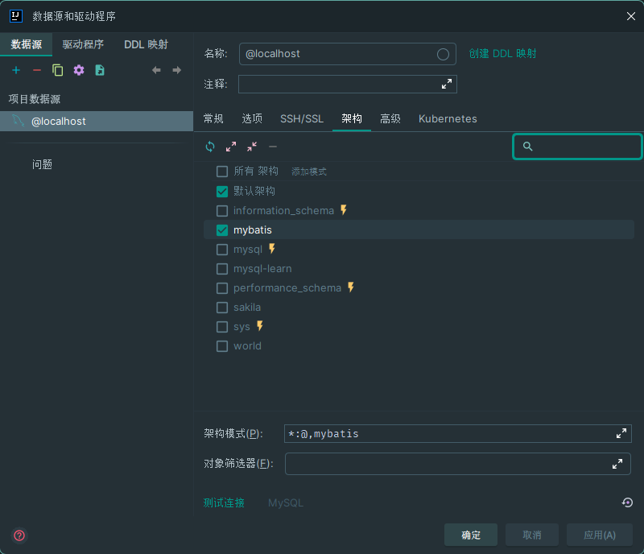
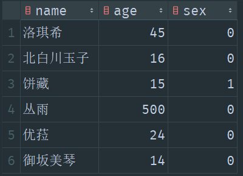

# 18. SpringBoot 连接数据库

需要安装依赖：

```java
spring web

thymeleaf

lombok

jdbc api

mybatis framework

mysql dirver
```

  

  

## 配置连接

<name>application.yml</name>

```yml
spring:
  datasource:
    username: root
    password: huaxvcode
    url: jdbc:mysql://localhost:3306/mybatis?useUnicode=true&characterEncoding=utf-8&serverTimezone=UTC
    driver-class-name: com.mysql.cj.jdbc.Driver
```

## 测试连接

在测试类中，自动装配数据源：

<name>Demo2ApplicationTests.java</name>

```java
@SpringBootTest
class Demo2ApplicationTests {
    // 自动装箱数据源
    @Autowired
    DataSource data;

    @Test
    void contextLoads() throws SQLException {
        System.out.println(data);

        // 获取数据库连接
        var connection = data.getConnection();

        // 关闭数据库连接
        connection.close();
    }

}
```

输出：

```
HikariDataSource (null)
```

## 获取表数据

user 表的内容：

  

<name>controller/JDBCController.java</name>

```java
@RestController
public class JDBCController {
    @Autowired
    JdbcTemplate jdbcTemplate;

    @GetMapping("/user")
    public List<Map<String, Object>> getUser() {
        String sql = "select * from user";
        return jdbcTemplate.queryForList(sql);
    }
}
```

前端页面返回：

```
[
    {
        "name": "洛琪希",
        "age": 45,
        "sex": false
    },
    {
        "name": "北白川玉子",
        "age": 16,
        "sex": false
    },
    {
        "name": "饼藏",
        "age": 15,
        "sex": true
    },
    {
        "name": "丛雨",
        "age": 500,
        "sex": false
    },
    {
        "name": "优菈",
        "age": 24,
        "sex": false
    },
    {
        "name": "御坂美琴",
        "age": 14,
        "sex": false
    }
]
```
