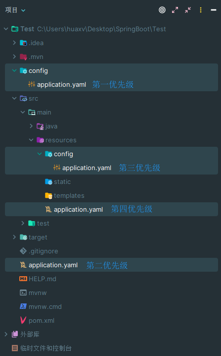

# 5. application.yaml 多环境配置文件

`application.yaml` 文件可以出现在如下位置（按照优先级降序）：

1. `file: ./config/`
2. `file: ./`
3. `classpath: /config/`
4. `classpath: /`

  

## 多环境配置文件

<details open><summary>application.yaml</summary>

选取某环境的配置文件：

```yaml
spring:
  profiles:
    active: dev
```

</details>

<details><summary>application-test.yaml</summary>

```yaml
Human:
  name: tom
  age: -22
  birth: 2000/1/1
  favourite: [ test1, 13331, test demo ]
  info:
    mess: this is a test message.
```

</details>

<details><summary>application-dev.yaml</summary>

```yaml
Human:
  name: lrq
  age: 22
  birth: 2002/11/14
  favourite: [ acm, java, c++, genshin impact, galgame ]
  info:
    school: 韶关学院
    icpc: 铜牌
    ccpc: 铜牌
    gdcpc: 铜牌
    蓝桥杯: 国家级一等奖
```

</details>

  

