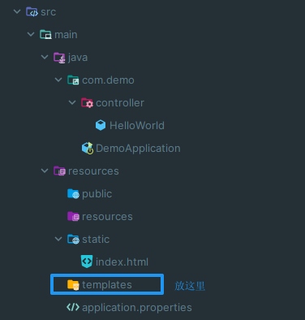

# 7. thymeleaf 模板引擎

Thymeleaf是一个模板引擎，主要用于编写动态页面。

## 前置

thymeleaf 的所有模板，都需要放在目录：`classpath: /templates` 里面

  

**必须使用 `controller` 里面的控制器，才能显示 `templates` 目录的 html 文件**

示例：

在 templates 目录内创建一个 `Test.html` 文件

<details><summary>Test.html</summary>

```html
<!DOCTYPE html>
<html lang="en">
<head>
    <meta charset="UTF-8">
    <title>Test</title>
</head>
<body>
<h1>This is a test file</h1>
</body>
</html>
```

</details>

在 controller 目录内创建一个 `Test.java` 控制器，返回 templates 目录下的 `Test.html` 资源

<details><summary>Test.java</summary>

```java
@Controller
public class Test {
    @RequestMapping("/Test")
    public String getTestHml() {
        return "Test"; // 返回的是 templates 目录下的 Test.html 文件资源
    }
}
```

</details>

## 使用

在模板 html 中加入：`xmlns:th="http://www.thymeleaf.org"`

示例：

<details><summary>Test.html</summary>

```html
<!DOCTYPE html>
<html lang="en" xmlns:th="http://www.thymeleaf.org">
<head>
    <meta charset="UTF-8">
    <title>Test</title>
</head>
<body>
<h1>This is a test file</h1>
</body>
</html>
```

</details>

## Java 传递信息给 Html 文件

<details><summary>Test.java</summary>

```java
@Controller
public class Test {
    @RequestMapping("/Test")
    public String getTestHml(Model model) {
        // 传递一个变量 msg 给 html 文件
        model.addAttribute("msg", "<h1>hello, this world</h1>");
        return "Test"; // 返回的是 templates 目录下的 Test.html 文件资源
    }
}
```

</details>

<details><summary>Test.html</summary>

```html
<!DOCTYPE html>
<html lang="en" xmlns:th="http://www.thymeleaf.org">
<head>
    <meta charset="UTF-8">
    <title>Test</title>
</head>
<body>
<!-- 使用 java 传递过来的变量 msg 的内容 -->
<div th:text="${msg}"></div>
</body>
</html>
```

</details>